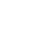

<br>

[![x][x-shield]][x-url]
[![LinkedIn][linkedin-shield]][linkedin-url]


<!-- PROJECT LOGO -->
<br />
<div align="center">
  <a href="https://github.com/annilltimothy/hyperiondev">
    
  </a>
  <br>

  <h3 align="center">HyperionDev Landing Page</h3>

</div>


<br><br>
<!-- TABLE OF CONTENTS -->
<details>
  <summary>Table of Contents</summary>
  <ol>
    <li>
      <a href="#about-the-project">About The Project</a>
      <ul>
        <li><a href="#built-with">Built With</a></li>
      </ul>
    </li>
    <li>
      <a href="#getting-started">Getting Started</a>
      <ul>
        <li><a href="#prerequisites">Prerequisites</a></li>
        <li><a href="#installation">Installation</a></li>
      </ul>
    </li>
    <li><a href="#contact">Contact</a></li>
    <li><a href="#licence">License</a></li>
  </ol>
</details>
<br>

<br>

<!-- ABOUT THE PROJECT -->
### About The Project

<br>
[![Product Name Screen Shot][product-screenshot]](https://hyperiondev.com)

<br>
This redesign of the HyperionDev landing page, predominently using HTML, CSS, GSAP and FLASK.

<br>

Here's why:
* FLASK to adhere with DRY principals. Everything is written in smaller templates and components to make it easier to maintain and remove as it becomes redundant. 
* FLASK assists here by allowing the use of SASS and CSS interchangably as needed without needing to interfere with any other stylesheets, templates or components.
* GSAP for quick and easy animations and transitions to make the page more interactive and to simplify front end data rendering.
* Very simple to add new templates and stylesheet directly to the DOM. 
* Addional funcionality like filtering can easily be added with Python.
* SASS to stay DRY as far as possible and for styling with variables.

<br>

I also chose flask to render the new landing page in a really compact and modular way in order to improve maintenance.

<br>

### Built With

<br>

* [![Flask][Flask]][Flask-url]
* [![Sass][Sass]][Sass-url]
* [![html][html]][html-url]
* [![gsap][gsap]][gsap-url]

<br><br>

<!-- GETTING STARTED -->
### Getting Started

<br>

Make sure the latest version of pip is installed. Check using command 
  ```sh
  pip --version
  ```

If you don't have it installed, you can install it here - [python](https://www.python.org/downloads/) 

<br>

Make sure the latest version of Python is installed. Check using command 
  ```sh
  Python --version
  ```

If you don't have it installed, you can install it here - [pip](https://pip.pypa.io/en/stable/installation/) 

<br>

### Prerequisites
<br>

Create a virtual env
  ```sh
  python3 -m venv venv
  ```

Activate virtual env using 

  ```sh
  source venv/bin/activate
  ```
<br>

### Installation


_Below is an example of how you can instruct your audience on installing and setting up your app. This template doesn't rely on any external dependencies or services._

1. Clone the repo
   ```sh
   git clone https://github.com/annilltimothy/hyperiondev.git
   ```
2. Once you are in the main directory, install dependencies using 
   ```sh
   pip install -r requirements.txt
   ```
3. Run application using 
   ```sh
   flask --app application run
   ```
   Alternatively use
   ```sh
   python application.py
   ```


<br><br>

<!-- CONTACT -->
## Contact

Twitter - [@annilltimothy](https://x.com/annilltimothy) 
<br>
Email - annilltimothy@icloud.com
<br>
Personal Website: [https://annilltimothy.com/](https://annilltimothy.com/portfolio)


<br><br>

<!-- ACKNOWLEDGMENTS -->
## Acknowledgments

* [Greensock Animation Library](https://greensock.com)
* [GitHub Emoji Cheat Sheet](https://www.webpagefx.com/tools/emoji-cheat-sheet)
* [Malven's Flexbox Cheatsheet](https://flexbox.malven.co/)
* [Malven's Grid Cheatsheet](https://grid.malven.co/)
* [Img Shields](https://shields.io)
* [GitHub Pages](https://pages.github.com)
* [Font Awesome](https://fontawesome.com)


<!-- MARKDOWN LINKS & IMAGES -->
<!-- https://www.markdownguide.org/basic-syntax/#reference-style-links -->
[website-shield]: https://img.shields.io/badge/:badgeContent
[website-url]: https://annilltimothy.com/portfolio
[license-url]: https://github.com/othneildrew/Best-README-Template/blob/master/LICENSE.txt
[linkedin-shield]: https://img.shields.io/badge/-LinkedIn-black.svg?style=for-the-badge&logo=linkedin&colorB=555
[linkedin-url]: https://www.linkedin.com/in/annill-timothy-2ba354161/
[x-url]: https://www.x.com/annilltimothy/
[x-shield]: https://img.shields.io/badge/-twitter-black.svg?style=for-the-badge&logo=twitter&colorB=555
[product-screenshot]: static/images/screenshot.png
[Sass]: https://img.shields.io/badge/Sass-C76494?style=for-the-badge&logo=Sass&logoColor=white
[Sass-url]: https://Sass-lang.com/

[html]: https://img.shields.io/badge/html-20232A?style=for-the-badge&logo=html&logoColor=61DAFB
[html-url]: https://html.org/
[Flask]: https://img.shields.io/badge/Flask-0769AD?style=for-the-badge&logo=Flask&logoColor=white
[Flask-url]: https://Flask.com
[gsap]: https://img.shields.io/badge/gsap-88ce02?style=for-the-badge&logo=gsap&logoColor=white
[gsap-url]: https://greensock.com


<p align="right">(<a href="#readme-top">back to top</a>)</p>

